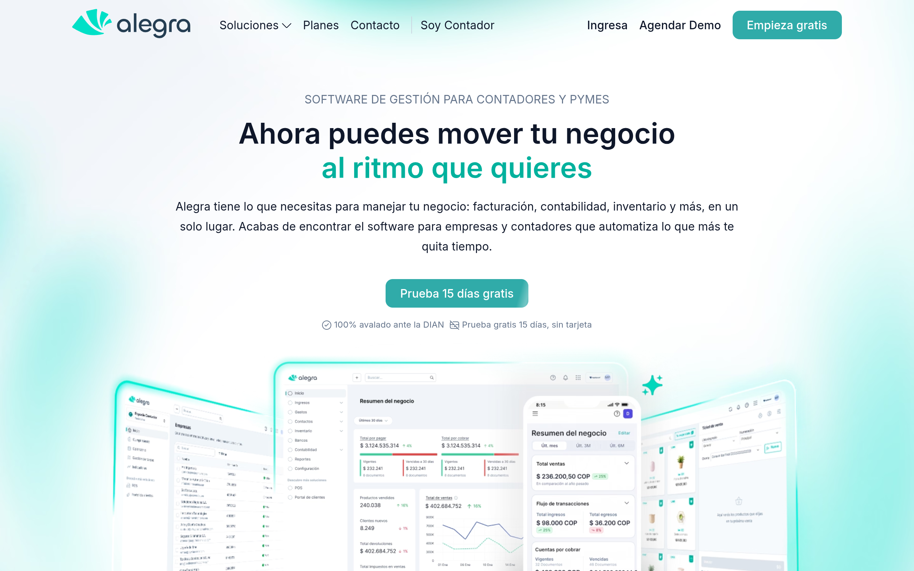

# alegra Design System

You are building UI for **alegra**. Light-themed, cool palette, sans-serif typography (Lexend), standard density on a 5px grid, expressive motion.

## Visual Reference

**IMPORTANT**: Study ALL screenshots below before writing any UI. Match colors, typography, spacing, layout, and motion exactly as shown.

### Homepage



> Read `references/DESIGN.md` for full token details.

## Design Philosophy

- **Layered depth** — use shadow tokens to create a sense of physical layering. Each elevation level has a specific shadow.
- **Gradient accents** — gradients are used thoughtfully for emphasis, not decoration.
- **Type pairing** — Lexend for body/UI text, Inter for headings/display. Never introduce a third typeface.
- **standard density** — 5px base grid. Every dimension is a multiple of 5.
- **cool palette** — the color temperature runs cool, matching the sans-serif typography.
- **Restrained accent** — `#00d6bc` is the only pop of color. Used exclusively for CTAs, links, focus rings, and active states.
- **Expressive motion** — animations are an integral part of the experience. Use spring physics and layout animations.

## Color System

### Core Palette

| Role | Token | Hex | Use |
|------|-------|-----|-----|
| Background | `--background` | `#ffffff` | Page/app background |
| Surface | `--surface` | `#f1f5f9` | Cards, panels, modals |
| Text Primary | `--text-primary` | `#0f172a` | Headings, body text |
| Text Muted | `--text-muted` | `#9ca3af` | Captions, placeholders |
| Accent | `--accent` | `#00d6bc` | CTAs, links, focus rings |
| Border | `--border` | `#475569` | Dividers, card borders |

### Status Colors

| Status | Hex | Use |
|--------|-----|-----|
| Success | `#e2fee2` | Confirmations, positive trends |

### Extended Palette

- **lovable-color-primary-600:** `#30aba9`
- **lovable-muted:** `#64748b` — Secondary text, placeholder text
- `#334155`
- **lovable-border:** `#e5e7eb` — Light surface or highlight color
- `#001e3b` — Deep background layer or shadow color
- `#000000` — Deep background layer or shadow color
- `#18283f`
- **lovable-color-primary-vibrant:** `#06ecd0`

### CSS Variable Tokens

```css
--cards-count: 3;
--cards-count: 3;
--lovable-color-primary-50: #EAFAFA;
--lovable-color-primary-100: #CFF2F1;
--lovable-color-primary-200: #B6ECE9;
--lovable-color-primary-300: #9BE4E0;
--lovable-color-primary-400: #72D5D1;
--lovable-color-primary-500: #30BBB7;
--lovable-color-primary-600: #30ABA9;
--lovable-color-primary-700: #299E9C;
--lovable-color-primary-800: #208D8D;
--lovable-color-primary-900: #1A7E7F;
--lovable-color-primary-vibrant: #06ECD0;
--lovable-primary: var(--lovable-color-primary-600);
--lovable-primary-end: var(--lovable-color-primary-500);
--lovable-primary-dark: var(--lovable-color-primary-800);
--lovable-primary-glow: rgba(48,171,169,.08);
--lovable-primary-soft: rgba(48,171,169,.08);
--lovable-primary-shadow: rgba(48,171,169,.15);
--lovable-accent-bg: var(--lovable-color-primary-50);
```

## Typography

### Font Stack

- **Lexend** — Heading 1, Heading 2, Heading 3
- **Inter** — Body, Caption
- **SFMono-Regular** — Code

### Font Sources

```css
@font-face {
  font-family: "Inter";
  src: url("fonts/Inter-Bold.ttf") format("truetype");
  font-weight: 700;
}
@font-face {
  font-family: "Inter";
  src: url("fonts/Inter-Regular.ttf") format("truetype");
  font-weight: 400;
}
@font-face {
  font-family: "Lexend";
  src: url("fonts/Lexend-Bold.ttf") format("truetype");
  font-weight: 700;
}
@font-face {
  font-family: "Lexend";
  src: url("fonts/Lexend-Regular.ttf") format("truetype");
  font-weight: 400;
}
@font-face {
  font-family: "Montserrat";
  src: url("fonts/Montserrat-Bold.ttf") format("truetype");
  font-weight: 700;
}
@font-face {
  font-family: "Montserrat";
  src: url("fonts/Montserrat-Regular.ttf") format("truetype");
  font-weight: 400;
}
@font-face {
  font-family: "Mulish";
  src: url("fonts/Mulish-Bold.ttf") format("truetype");
  font-weight: 700;
}
@font-face {
  font-family: "Mulish";
  src: url("fonts/Mulish-Regular.ttf") format("truetype");
  font-weight: 400;
}
@font-face {
  font-family: "Roboto";
  src: url("fonts/Roboto-Bold.ttf") format("truetype");
  font-weight: 700;
}
@font-face {
  font-family: "Roboto";
  src: url("fonts/Roboto-Regular.ttf") format("truetype");
  font-weight: 400;
}
@font-face {
  font-family: "Poppins";
  src: url("fonts/Poppins-Bold.ttf") format("truetype");
  font-weight: 700;
}
@font-face {
  font-family: "Poppins";
  src: url("fonts/Poppins-Regular.ttf") format("truetype");
  font-weight: 400;
}
```

### Type Scale

| Role | Family | Size | Weight |
|------|--------|------|--------|
| Heading 1 | Lexend | 113.859px | 700 |
| Heading 2 | Lexend | 104px | 700 |
| Heading 3 | Lexend | 72px | 700 |
| Body | Inter | .875rem | 400 |
| Caption | Inter | .75rem | 400 |
| Code | SFMono-Regular | 14px | 400 |

### Typography Rules

- Body/UI: **Lexend**, Headings: **Inter** — these are the only display fonts
- Max 3-4 font sizes per screen
- Headings: weight 600-700, body: weight 400
- Use color and opacity for text hierarchy, not additional font sizes
- Line height: 1.5 for body, 1.2 for headings

## Spacing & Layout

### Base Grid: 5px

Every dimension (margin, padding, gap, width, height) must be a multiple of **5px**.

### Spacing Scale

`5, 10, 15, 20, 25, 30, 35, 40, 45, 50, 55, 60` px

### Spacing as Meaning

| Spacing | Use |
|---------|-----|
| 2.5-5px | Tight: related items within a group |
| 10px | Medium: between groups |
| 15-20px | Wide: between sections |
| 30px+ | Vast: major section breaks |

### Border Radius

Scale: `.125rem, .25rem, .375rem, .5rem, .75rem, 1rem, 1.5rem, 2px, 2.6em, 3px, 3em, 4px, 5px, 6px, 7px, 8px, 9px, 9.193px, 10px, 11px, 12px, 13px, 14px, 15px, 16px, 17px, 18px, 20px, 22px, 24px, 25px, 30px, 32px, 34px, 35px, 38px, 43px, 64px, 99px, 100px, 100%, 475px, 999px, inherit`
Default: `14px`

### Container

Max-width: `1024px`, centered with auto margins.

### Breakpoints

| Name | Value |
|------|-------|
| xs | 350px |
| xs | 360px |
| xs | 373px |
| xs | 400px |
| xs | 431px |
| xs | 450px |
| xs | 480px |
| sm | 490px |
| sm | 520px |
| sm | 540px |
| sm | 548px |
| sm | 550px |
| sm | 600px |
| sm | 639px |
| sm | 640px |
| md | 767px |
| md | 768px |
| lg | 790px |
| lg | 799px |
| lg | 839px |
| lg | 840px |
| lg | 860px |
| lg | 900px |
| lg | 980px |
| lg | 1023px |
| lg | 1024px |
| xl | 1160px |
| xl | 1180px |
| xl | 1200px |
| xl | 1280px |
| 2xl | 1350px |
| 2xl | 1439px |
| 2xl | 1440px |
| 2xl | 1500px |
| 2xl | 1536px |

Mobile-first: design for small screens, layer on responsive overrides.

## Component Patterns

### Card

```css
.card {
  background: #f1f5f9;
  border: 1px solid #475569;
  border-radius: 14px;
  padding: 20px;
  box-shadow: 0 4px 6px -1px #0000001a,0 2px 4px -1px #0000000f;
}
```

```html
<div class="card">
  <h3>Card Title</h3>
  <p>Card content goes here.</p>
</div>
```

### Button

```css
/* Primary */
.btn-primary {
  background: #00d6bc;
  color: #0f172a;
  border-radius: 14px;
  padding: 10px 20px;
  font-weight: 500;
  transition: opacity 150ms ease;
}
.btn-primary:hover { opacity: 0.9; }

/* Ghost */
.btn-ghost {
  background: transparent;
  border: 1px solid #475569;
  color: #0f172a;
  border-radius: 14px;
  padding: 10px 20px;
}
```

```html
<button class="btn-primary">Get Started</button>
<button class="btn-ghost">Learn More</button>
```

### Input

```css
.input {
  background: #ffffff;
  border: 1px solid #475569;
  border-radius: 14px;
  padding: 10px 15px;
  color: #0f172a;
  font-size: 14px;
}
.input:focus { border-color: #00d6bc; outline: none; }
```

```html
<input class="input" type="text" placeholder="Search..." />
```

### Badge / Chip

```css
.badge {
  display: inline-flex;
  align-items: center;
  padding: 5px 10px;
  border-radius: 9999px;
  font-size: 12px;
  font-weight: 500;
  background: #f1f5f9;
  color: #9ca3af;
}
```

```html
<span class="badge">New</span>
<span class="badge">Beta</span>
```

### Modal / Dialog

```css
.modal-backdrop { background: rgba(0, 0, 0, 0.6); }
.modal {
  background: #f1f5f9;
  border: 1px solid #475569;
  border-radius: inherit;
  padding: 30px;
  max-width: 480px;
  width: 90vw;
  box-shadow: 0 2px 6px -2px #0000000d,0 10px 15px -3px #0000001a;
}
```

```html
<div class="modal-backdrop">
  <div class="modal">
    <h2>Dialog Title</h2>
    <p>Dialog content.</p>
    <button class="btn-primary">Confirm</button>
    <button class="btn-ghost">Cancel</button>
  </div>
</div>
```

### Table

```css
.table { width: 100%; border-collapse: collapse; }
.table th {
  text-align: left;
  padding: 10px 15px;
  font-weight: 500;
  font-size: 12px;
  color: #9ca3af;
  text-transform: uppercase;
  letter-spacing: 0.05em;
  border-bottom: 1px solid #475569;
}
.table td {
  padding: 15px;
  border-bottom: 1px solid #475569;
}
```

```html
<table class="table">
  <thead><tr><th>Name</th><th>Status</th><th>Date</th></tr></thead>
  <tbody>
    <tr><td>Item One</td><td>Active</td><td>Jan 1</td></tr>
    <tr><td>Item Two</td><td>Pending</td><td>Jan 2</td></tr>
  </tbody>
</table>
```

### Navigation

```css
.nav {
  display: flex;
  align-items: center;
  gap: 10px;
  padding: 15px 20px;
  border-bottom: 1px solid #475569;
}
.nav-link {
  color: #9ca3af;
  padding: 10px 15px;
  border-radius: 14px;
  transition: color 150ms;
}
.nav-link:hover { color: #0f172a; }
.nav-link.active { color: #00d6bc; }
```

```html
<nav class="nav">
  <a href="/" class="nav-link active">Home</a>
  <a href="/about" class="nav-link">About</a>
  <a href="/pricing" class="nav-link">Pricing</a>
  <button class="btn-primary" style="margin-left: auto">Get Started</button>
</nav>
```

### Extracted Components

These components were found in the codebase:

**Button** (`html`)

**Card** (`html`)
- Variants: `-container`, `-title--container`, `-title`, `-text`

**Badge** (`html`)

**List** (`html`)

## Page Structure

The following page sections were detected:

- **Navigation** — Top navigation bar (9 items)
- **Hero** — Hero/banner section with headline and CTAs
- **Features** — Feature/benefit cards grid (24 items)
- **Faq** — FAQ/accordion section
- **Footer** — Page footer with links and info (72 items)
- **Cta** — Call-to-action section
- **Stats** — Statistics/metrics display
- **Testimonials** — Testimonials/reviews section

When building pages, follow this section order and structure.

## Animation & Motion

This project uses **expressive motion**. Animations are part of the design language.

### CSS Animations

- `pulse`
- `zoom-in`
- `border-pulsate`
- `slideLogos`
- `slideLogosExtend`

### Motion Tokens

- **Duration scale:** `0ms`, `.1s`, `.15s`, `.2s`, `.3s`, `.4s`, `.5s`, `.6s`, `.7s`, `1.5s`, `4s`, `5s`, `5ms`, `50ms`, `90ms`, `100ms`, `120ms`, `150ms`, `180ms`, `200ms`, `250ms`, `300ms`, `350ms`, `400ms`, `450ms`, `500ms`, `550ms`, `600ms`, `650ms`, `700ms`, `750ms`, `800ms`, `20000ms`
- **Easing functions:** `cubic-bezier(.4,0,.2,1)`, `cubic-bezier(0,0,.2,1)`, `ease`, `linear`, `ease-in-out`, `ease-in`, `ease-out`, `cubic-bezier(.16,1,.3,1)`, `cubic-bezier(.39,.58,.57,1)`, `cubic-bezier(.34,1.56,.64,1)`
- **Animated properties:** `opacity`, `transform`, `visibility`

### Motion Guidelines

- **Duration:** Use values from the duration scale above. Short (0ms) for micro-interactions, long (20000ms) for page transitions
- **Easing:** Use `cubic-bezier(.4,0,.2,1)` as the default easing curve
- **Direction:** Elements enter from bottom/right, exit to top/left
- **Reduced motion:** Always respect `prefers-reduced-motion` — disable animations when set

## Depth & Elevation

### Shadow Tokens

- Subtle: `0 1px #e4e9f6 inset`
- Subtle: `0 0 0 1px inset #00000014`
- Subtle: `0 1px 1px #0000004d`
- Subtle: `0 1px 2px #0000000f`
- Subtle: `0 1px 2px #1018280a`
- Raised (cards, buttons): `0 4px 6px -1px #0000001a,0 2px 4px -1px #0000000f`

### Z-Index Scale

`0, 1, 2, 3, 5, 8, 9, 10, 20, 40, 50, 100, 200, 9999`

Use these exact values — never invent z-index values.

## Anti-Patterns (Never Do)

- **No blur effects** — no backdrop-blur, no filter: blur()
- **No zebra striping** — tables and lists use borders for separation
- **No invented colors** — every hex value must come from the palette above
- **No arbitrary spacing** — every dimension is a multiple of 5px
- **No extra fonts** — only Lexend and Inter and SFMono-Regular are allowed
- **No arbitrary border-radius** — use the scale: .125rem, .25rem, .375rem, .5rem, .75rem, 1rem, 1.5rem, 2px, 2.6em, 3px
- **No opacity for disabled states** — use muted colors instead

## Workflow

1. **Read** `references/DESIGN.md` before writing any UI code
2. **Pick colors** from the Color System section — never invent new ones
3. **Set typography** — Lexend, Inter, SFMono-Regular only, using the type scale
4. **Build layout** on the 5px grid — check every margin, padding, gap
5. **Match components** to patterns above before creating new ones
6. **Apply elevation** — use shadow tokens
7. **Validate** — every value traces back to a design token. No magic numbers.

## Brand Spec

- **Favicon:** `/favicon.svg`
- **Site URL:** `https://alegra.com/colombia/`
- **Brand color:** `#00d6bc`
- **Brand typeface:** Lexend

## Quick Reference

```
Background:     #ffffff
Surface:        #f1f5f9
Text:           #0f172a / #9ca3af
Accent:         #00d6bc
Border:         #475569
Font:           Lexend
Spacing:        5px grid
Radius:         14px
Components:     9 detected
```

## When to Trigger

Activate this skill when:
- Creating new components, pages, or visual elements for alegra
- Writing CSS, Tailwind classes, styled-components, or inline styles
- Building page layouts, templates, or responsive designs
- Reviewing UI code for design consistency
- The user mentions "alegra" design, style, UI, or theme
- Generating mockups, wireframes, or visual prototypes

---

# Full Reference Files

> Every output file is embedded below. Claude has full design system context from /skills alone.

## Design System Tokens (DESIGN.md)

# alegra DESIGN.md

> Auto-generated design system — reverse-engineered via static analysis by skillui.
> Frameworks: None detected
> Colors: 20 · Fonts: 3 · Components: 9
> Icon library: not detected · State: not detected
> Primary theme: light · Dark mode toggle: no · Motion: expressive

## Visual Reference

**Match this design exactly** — study colors, fonts, spacing, and component shapes before writing any UI code.


---

## 1. Visual Theme & Atmosphere

This is a **light-themed** interface with a cool, approachable feel. The light background emphasizes content clarity. Typography pairs **Inter** for display/headings with **Lexend** for body text, creating clear visual hierarchy through type contrast. Spacing follows a **5px base grid** (standard density), with scale: 5, 10, 15, 20, 25, 30, 35, 40px. The palette is predominantly monochromatic with **#00d6bc** as the single accent color — used sparingly for interactive elements and emphasis. Motion is expressive — spring physics, layout animations, and staggered reveals are part of the visual language.

---

## 2. Color Palette & Roles

| Token | Hex | Role | Use |
|---|---|---|---|
| tw-ring-offset-color | `#ffffff` | background | Page background, darkest surface |
| lovable-color-primary-50 | `#f1f5f9` | surface | Card and panel backgrounds |
| text-primary | `#0f172a` | text-primary | Headings and body text |
| text-muted | `#9ca3af` | text-muted | Captions, placeholders, secondary info |
| border | `#475569` | border | Dividers, card borders, outlines |
| accent | `#00d6bc` | accent | CTAs, links, focus rings, active states |
| success | `#e2fee2` | success | Success states, positive indicators |
| info | `#001e3b` | info | Informational highlights |
| lovable-color-primary-600 | `#30aba9` | unknown | Palette color |
| lovable-muted | `#64748b` | unknown | Palette color |
| unknown | `#334155` | unknown | Palette color |
| lovable-border | `#e5e7eb` | unknown | Palette color |
| unknown | `#000000` | unknown | Palette color |
| unknown | `#18283f` | unknown | Palette color |
| lovable-color-primary-vibrant | `#06ecd0` | unknown | Palette color |
| lovable-color-primary-900 | `#1a7e7f` | unknown | Palette color |
| unknown | `#0d3341` | unknown | Palette color |
| lovable-color-primary-100 | `#cff2f1` | unknown | Palette color |
| unknown | `#42b983` | unknown | Palette color |
| lovable-color-primary-700 | `#299e9c` | unknown | Palette color |

### CSS Variable Tokens

```css
--tw-border-spacing-x: 0;
--tw-border-spacing-y: 0;
--tw-border-spacing-x: 0;
--tw-border-spacing-y: 0;
--tw-border-opacity: 1;
--tw-border-opacity: 1;
--tw-border-opacity: 1;
--tw-border-opacity: 1;
--tw-border-opacity: 1;
--tw-border-opacity: 1;
--tw-border-opacity: 1;
--tw-border-opacity: 1;
--tw-border-opacity: 1;
--tw-border-opacity: 1;
--tw-border-opacity: 1;
--tw-border-opacity: 1;
--tw-border-opacity: 1;
--tw-border-opacity: 1;
--tw-border-opacity: 1;
--tw-border-opacity: 1;
```


---

## 3. Typography Rules

**Font Stack:**
- **Lexend** — Heading 1, Heading 2, Heading 3
- **Inter** — Body, Caption
- **SFMono-Regular** — Code

**Font Sources:**

```css
@font-face {
  font-family: "Inter";
  src: url("fonts/Inter-Bold.ttf") format("truetype");
  font-weight: 700;
}
@font-face {
  font-family: "Inter";
  src: url("fonts/Inter-Regular.ttf") format("truetype");
  font-weight: 400;
}
@font-face {
  font-family: "Lexend";
  src: url("fonts/Lexend-Bold.ttf") format("truetype");
  font-weight: 700;
}
@font-face {
  font-family: "Lexend";
  src: url("fonts/Lexend-Regular.ttf") format("truetype");
  font-weight: 400;
}
@font-face {
  font-family: "Montserrat";
  src: url("fonts/Montserrat-Bold.ttf") format("truetype");
  font-weight: 700;
}
@font-face {
  font-family: "Montserrat";
  src: url("fonts/Montserrat-Regular.ttf") format("truetype");
  font-weight: 400;
}
@font-face {
  font-family: "Mulish";
  src: url("fonts/Mulish-Bold.ttf") format("truetype");
  font-weight: 700;
}
@font-face {
  font-family: "Mulish";
  src: url("fonts/Mulish-Regular.ttf") format("truetype");
  font-weight: 400;
}
@font-face {
  font-family: "Roboto";
  src: url("fonts/Roboto-Bold.ttf") format("truetype");
  font-weight: 700;
}
@font-face {
  font-family: "Roboto";
  src: url("fonts/Roboto-Regular.ttf") format("truetype");
  font-weight: 400;
}
@font-face {
  font-family: "Poppins";
  src: url("fonts/Poppins-Bold.ttf") format("truetype");
  font-weight: 700;
}
@font-face {
  font-family: "Poppins";
  src: url("fonts/Poppins-Regular.ttf") format("truetype");
  font-weight: 400;
}
```

| Role | Font | Size | Weight |
|---|---|---|---|
| Heading 1 | Lexend | 113.859px | 700 |
| Heading 2 | Lexend | 104px | 700 |
| Heading 3 | Lexend | 72px | 700 |
| Body | Inter | .875rem | 400 |
| Caption | Inter | .75rem | 400 |
| Code | SFMono-Regular | 14px | 400 |

**Typographic Rules:**
- Limit to 3 font families max per screen
- Use **Lexend** for body/UI text, **Inter** for display/headings
- Maintain consistent hierarchy: no more than 3-4 font sizes per screen
- Headings use bold (600-700), body uses regular (400)
- Line height: 1.5 for body text, 1.2 for headings
- Use color and opacity for secondary hierarchy, not additional font sizes


---

## 4. Component Stylings

### Layout (1)

**Footer** — `html`

### Navigation (1)

**Navigation** — `html`

### Data Display (3)

**Card** — `html`
- Variants: `-container`, `-title--container`, `-title`, `-text`

**Badge** — `html`

**List** — `html`

### Data Input (1)

**Button** — `html`
- Animation: 

### Overlay (1)

**Modal** — `html`

### Media (2)

**Image** — `html`

**Icon** — `html`


---

## 5. Layout Principles

- **Base spacing unit:** 5px
- **Spacing scale:** 5, 10, 15, 20, 25, 30, 35, 40, 45, 50, 55, 60
- **Border radius:** .125rem, .25rem, .375rem, .5rem, .75rem, 1rem, 1.5rem, 2px, 2.6em, 3px, 3em, 4px, 5px, 6px, 7px, 8px, 9px, 9.193px, 10px, 11px, 12px, 13px, 14px, 15px, 16px, 17px, 18px, 20px, 22px, 24px, 25px, 30px, 32px, 34px, 35px, 38px, 43px, 64px, 99px, 100px, 100%, 475px, 999px, inherit
- **Max content width:** 1024px

**Spacing as Meaning:**
| Spacing | Use |
|---|---|
| 2.5-5px | Tight: related items within a group |
| 10px | Medium: between groups |
| 15-20px | Wide: between sections |
| 30px+ | Vast: major section breaks |


---

## 6. Depth & Elevation

### Flat — subtle depth hints

- `0 1px #e4e9f6 inset`
- `0 0 0 1px inset #00000014`
- `0 1px 1px #0000004d`

### Raised — cards, buttons, interactive elements

- `0 4px 6px -1px #0000001a,0 2px 4px -1px #0000000f`
- `0 4px 4px #00000040`
- `0 1px 3px #0000001a`

### Floating — dropdowns, popovers, modals

- `0 2px 6px -2px #0000000d,0 10px 15px -3px #0000001a`
- `0 10px 15px -3px #0000001a`
- `0 10px 15px -5px #0000001a`

### Overlay — full-screen overlays, top-level dialogs

- `0 10px 25px -5px #0000001a,0 4px 10px -6px #00000014`
- `0 20px 60px -12px #0f172a29`
- `0 0 24px #06ecd0a6,inset 0 0 16px #06d0ec80`

### Z-Index Scale

`0, 1, 2, 3, 5, 8, 9, 10, 20, 40, 50, 100, 200, 9999`


---

## 7. Animation & Motion

This project uses **expressive motion**. Animations are an integral part of the experience.

### CSS Animations

- `@keyframes pulse`
- `@keyframes zoom-in`
- `@keyframes border-pulsate`
- `@keyframes slideLogos`
- `@keyframes slideLogosExtend`
- `@keyframes opacity2`
- `@keyframes opacity1`
- `@keyframes cards-simple-inline-grad`

### Animated Components

- **Button**: 

### Motion Guidelines

- Duration: 150-300ms for micro-interactions, 300-500ms for page transitions
- Easing: `ease-out` for enters, `ease-in` for exits
- Always respect `prefers-reduced-motion`


---

## 8. Do's and Don'ts

### Do's

- Use `#00d6bc` for interactive elements (buttons, links, focus rings)
- Use `#ffffff` as the primary page background
- Pair **Lexend** (body) with **Inter** (display) — these are the only allowed fonts
- Follow the **5px** spacing grid for all margins, padding, and gaps
- Use the defined shadow tokens for elevation — see Section 6
- Use border-radius from the scale: .125rem, .25rem, .375rem, .5rem, .75rem
- Reuse existing components from Section 4 before creating new ones

### Don'ts

- Don't introduce colors outside this palette — extend the design tokens first
- Don't introduce additional font families beyond Lexend and Inter and SFMono-Regular
- Don't use arbitrary spacing values — stick to multiples of 5px
- Don't create custom box-shadow values outside the system tokens
- Don't use arbitrary border-radius values — pick from the defined scale
- Don't duplicate component patterns — check Section 4 first
- Don't use backdrop-blur or blur effects

### Anti-Patterns (detected from codebase)

- No blur or backdrop-blur effects
- No zebra striping on tables/lists


---

## 9. Responsive Behavior

| Name | Value | Source |
|---|---|---|
| xs | 350px | css |
| xs | 360px | css |
| xs | 373px | css |
| xs | 400px | css |
| xs | 431px | css |
| xs | 450px | css |
| xs | 480px | css |
| sm | 490px | css |
| sm | 520px | css |
| sm | 540px | css |
| sm | 548px | css |
| sm | 550px | css |
| sm | 600px | css |
| sm | 639px | css |
| sm | 640px | css |
| md | 767px | css |
| md | 768px | css |
| lg | 790px | css |
| lg | 799px | css |
| lg | 839px | css |
| lg | 840px | css |
| lg | 860px | css |
| lg | 900px | css |
| lg | 980px | css |
| lg | 1023px | css |
| lg | 1024px | css |
| xl | 1160px | css |
| xl | 1180px | css |
| xl | 1200px | css |
| xl | 1280px | css |
| 2xl | 1350px | css |
| 2xl | 1439px | css |
| 2xl | 1440px | css |
| 2xl | 1500px | css |
| 2xl | 1536px | css |

**Approach:** Use `@media (min-width: ...)` queries matching the breakpoints above.


---

## 10. Agent Prompt Guide

Use these as starting points when building new UI:

### Build a Card

```
Background: #f1f5f9
Border: 1px solid #475569
Radius: 14px
Padding: 20px
Font: Lexend
Use shadow tokens from Section 6.
```

### Build a Button

```
Primary: bg #00d6bc, text white
Ghost: bg transparent, border #475569
Padding: 10px 20px
Radius: 14px
Hover: opacity 0.9 or lighter shade
Focus: ring with #00d6bc
```

### Build a Page Layout

```
Background: #ffffff
Max-width: 1024px, centered
Grid: 5px base
Responsive: mobile-first, breakpoints from Section 9
```

### Build a Stats Card

```
Surface: #f1f5f9
Label: #9ca3af (muted, 12px, uppercase)
Value: #0f172a (primary, 24-32px, bold)
Status: use success/warning/danger from Section 2
```

### Build a Form

```
Input bg: #ffffff
Input border: 1px solid #475569
Focus: border-color #00d6bc
Label: #9ca3af 12px
Spacing: 20px between fields
Radius: 14px
```

### General Component

```
1. Read DESIGN.md Sections 2-6 for tokens
2. Colors: only from palette
3. Font: Lexend, type scale from Section 3
4. Spacing: 5px grid
5. Components: match patterns from Section 4
6. Elevation: shadow tokens
```

## Bundled Fonts (fonts/)

The following font files are bundled in the `fonts/` directory:

- `fonts/Inter-Black.ttf`
- `fonts/Inter-Bold.ttf`
- `fonts/Inter-ExtraBold.ttf`
- `fonts/Inter-ExtraLight.ttf`
- `fonts/Inter-Light.ttf`
- `fonts/Inter-Medium.ttf`
- `fonts/Inter-Regular.ttf`
- `fonts/Inter-SemiBold.ttf`
- `fonts/Inter-Thin.ttf`
- `fonts/Lexend-Black.ttf`
- `fonts/Lexend-Bold.ttf`
- `fonts/Lexend-ExtraBold.ttf`
- `fonts/Lexend-ExtraLight.ttf`
- `fonts/Lexend-Light.ttf`
- `fonts/Lexend-Medium.ttf`
- `fonts/Lexend-Regular.ttf`
- `fonts/Lexend-SemiBold.ttf`
- `fonts/Lexend-Thin.ttf`
- `fonts/Montserrat-Black.ttf`
- `fonts/Montserrat-Bold.ttf`
- `fonts/Montserrat-ExtraBold.ttf`
- `fonts/Montserrat-ExtraLight.ttf`
- `fonts/Montserrat-Light.ttf`
- `fonts/Montserrat-Medium.ttf`
- `fonts/Montserrat-Regular.ttf`
- `fonts/Montserrat-SemiBold.ttf`
- `fonts/Montserrat-Thin.ttf`
- `fonts/Mulish-Black.ttf`
- `fonts/Mulish-Bold.ttf`
- `fonts/Mulish-ExtraBold.ttf`
- `fonts/Mulish-ExtraLight.ttf`
- `fonts/Mulish-Light.ttf`
- `fonts/Mulish-Medium.ttf`
- `fonts/Mulish-Regular.ttf`
- `fonts/Mulish-SemiBold.ttf`
- `fonts/Poppins-Black.ttf`
- `fonts/Poppins-Bold.ttf`
- `fonts/Poppins-ExtraBold.ttf`
- `fonts/Poppins-ExtraLight.ttf`
- `fonts/Poppins-Light.ttf`
- `fonts/Poppins-Medium.ttf`
- `fonts/Poppins-Regular.ttf`
- `fonts/Poppins-SemiBold.ttf`
- `fonts/Poppins-Thin.ttf`
- `fonts/Roboto-Black.ttf`
- `fonts/Roboto-Bold.ttf`
- `fonts/Roboto-ExtraBold.ttf`
- `fonts/Roboto-ExtraLight.ttf`
- `fonts/Roboto-Light.ttf`
- `fonts/Roboto-Medium.ttf`
- `fonts/Roboto-Regular.ttf`
- `fonts/Roboto-SemiBold.ttf`
- `fonts/Roboto-Thin.ttf`

Use these local font files in `@font-face` declarations instead of fetching from Google Fonts.

## Homepage Screenshots (screenshots/)


